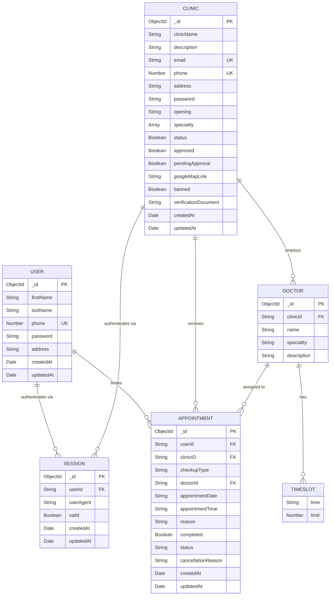
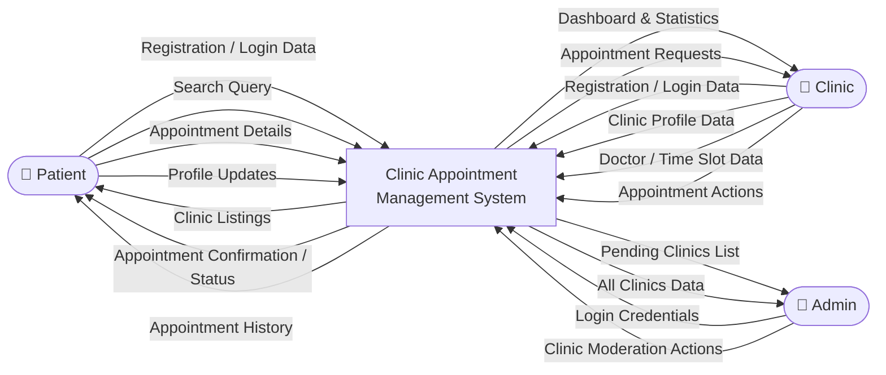
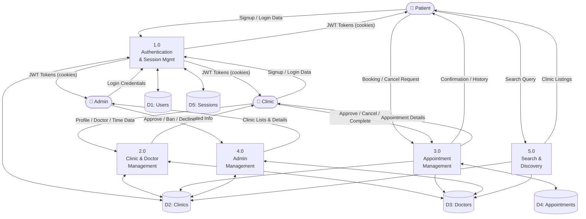
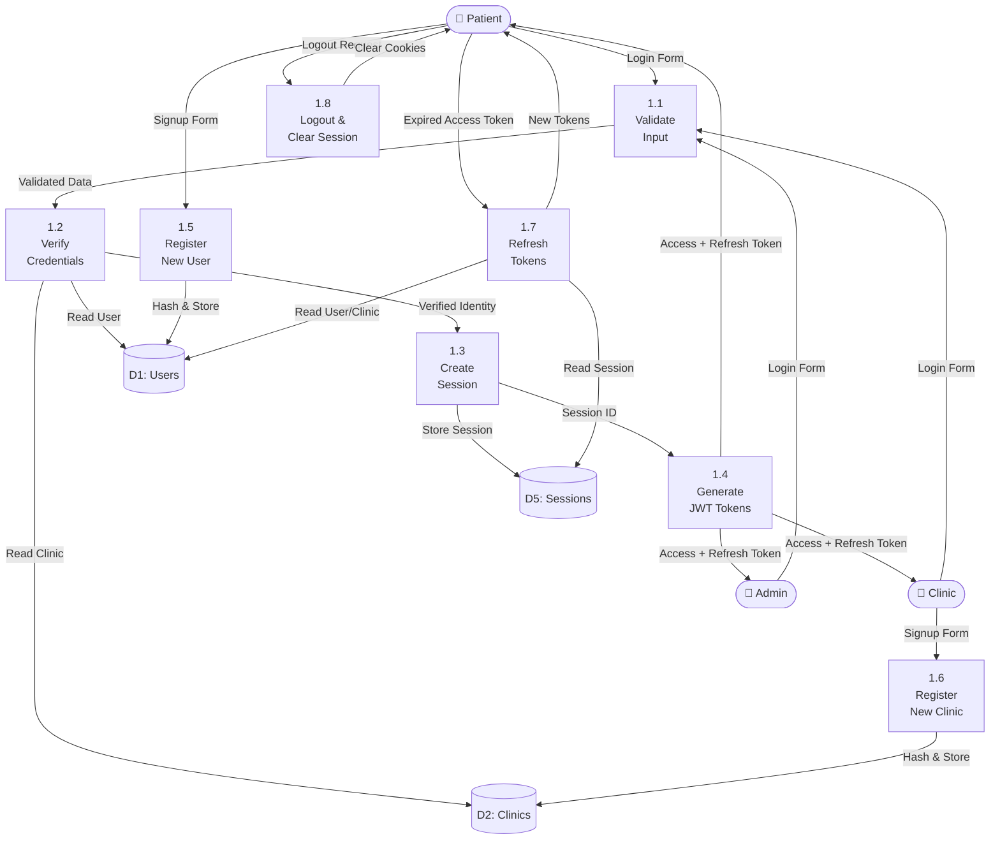
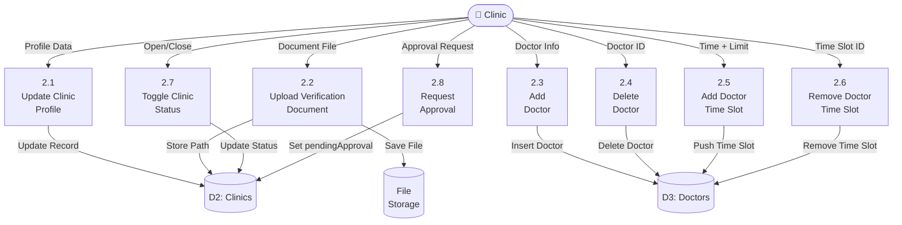
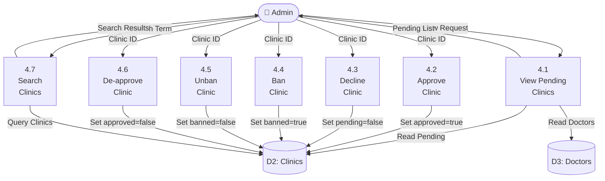
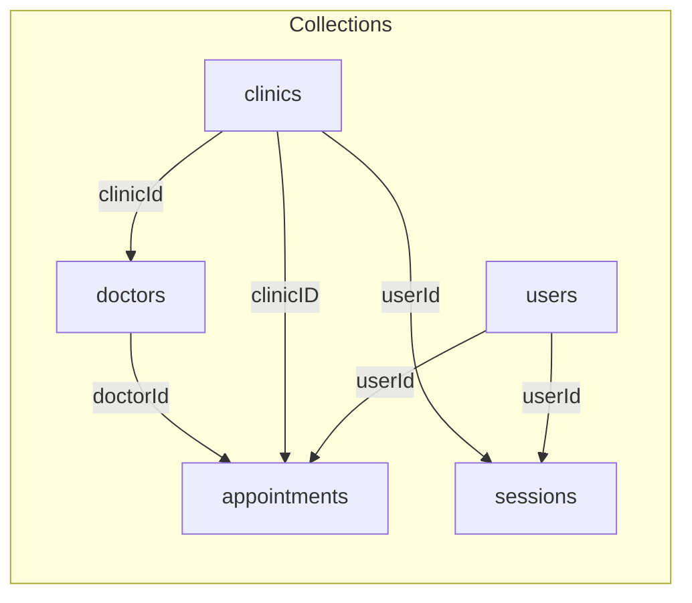

# Clinic Appointment Management System — System Documentation

> **Project:** Clinic-Appointment  

---

## Table of Contents

1. [System Overview](#1-system-overview)
2. [Functional Requirements](#2-functional-requirements)
3. [Data Modeling (ER Diagram)](#3-data-modeling-er-diagram)
4. [Data Flow Diagrams (DFD)](#4-data-flow-diagrams-dfd)
5. [Database Schema Design](#5-database-schema-design)
6. [Physical DFD](#6-physical-dfd)

---

## 1. System Overview

The **Clinic Appointment Management System** is a web-based application that enables patients to discover clinics, browse available doctors, and book medical appointments online. Clinics can register, manage their doctor roster and schedules, and process appointment requests. A system administrator oversees clinic approvals, bans, and platform integrity.

### Actors

| Actor | Description |
|-------|-------------|
| **Patient (User)** | Registers, searches clinics, books/cancels appointments, views appointment history |
| **Clinic** | Registers, manages profile & doctors, sets time slots, approves/cancels/completes appointments |
| **Admin** | Approves/declines/bans/unbans clinics, manages the platform |

---

## 2. Functional Requirements

### 2.1 Authentication & Session Management

| ID | Requirement |
|----|-------------|
| FR-1.1 | The system shall allow patients to register with first name, last name, phone number, and password. |
| FR-1.2 | The system shall allow clinics to register with clinic name, email, phone number, address, and password. |
| FR-1.3 | The system shall authenticate users (patients, clinics, admin) via phone number and password. |
| FR-1.4 | The system shall issue JWT-based access tokens (20 min expiry) and refresh tokens (20 day expiry) upon successful login. |
| FR-1.5 | The system shall store tokens in browser cookies and automatically refresh expired access tokens using the refresh token. |
| FR-1.6 | The system shall create a session record upon login, storing the user ID and user agent. |
| FR-1.7 | The system shall allow users to log out, clearing all authentication cookies. |
| FR-1.8 | The system shall hash all passwords using the Argon2 algorithm before storage. |
| FR-1.9 | The system shall validate all registration and login inputs (phone format, required fields, password strength). |
| FR-1.10 | The system shall prevent duplicate registrations using the same phone number (users) or email/phone (clinics). |

### 2.2 Patient (User) Functions

| ID | Requirement |
|----|-------------|
| FR-2.1 | The system shall display a home page listing all approved and active clinics with their doctors. |
| FR-2.2 | The system shall allow patients to search/filter clinics by name or address. |
| FR-2.3 | The system shall allow patients to view a clinic's details (name, address, phone, email, description, opening hours, Google Maps link, specialities, and available doctors). |
| FR-2.4 | The system shall allow patients to book an appointment by selecting a clinic, checkup type, doctor, date, and available time slot. |
| FR-2.5 | The system shall check time slot availability in real-time and enforce per-slot booking limits before allowing booking. |
| FR-2.6 | The system shall display a patient's appointments categorized into "Upcoming" and "Completed" lists. |
| FR-2.7 | The system shall allow patients to cancel their own pending appointments. |
| FR-2.8 | The system shall allow patients to update their profile information (first name, last name, address). |
| FR-2.9 | The system shall redirect clinic and admin users away from patient-facing pages to their respective dashboards. |

### 2.3 Clinic Functions

| ID | Requirement |
|----|-------------|
| FR-3.1 | The system shall provide a clinic dashboard with appointment statistics (total, pending, approved, cancelled, completed). |
| FR-3.2 | The system shall allow clinics to update their profile (description, address, opening hours, Google Maps link, speciality tags, and verification document). |
| FR-3.3 | The system shall allow clinics to upload a verification document (image file, max 5 MB). |
| FR-3.4 | The system shall allow clinics to add doctors with name, speciality, and description. |
| FR-3.5 | The system shall allow clinics to delete doctors from their roster. |
| FR-3.6 | The system shall allow clinics to add time slots to a doctor, specifying time and patient limit per slot. |
| FR-3.7 | The system shall allow clinics to remove time slots from a doctor. |
| FR-3.8 | The system shall allow clinics to toggle their active/inactive status (open/closed). |
| FR-3.9 | The system shall allow clinics to submit an approval request to the admin. |
| FR-3.10 | The system shall allow clinics to approve pending appointments. |
| FR-3.11 | The system shall allow clinics to cancel appointments with a mandatory cancellation reason. |
| FR-3.12 | The system shall allow clinics to mark appointments as completed. |
| FR-3.13 | The system shall display today's approved appointments for quick overview. |
| FR-3.14 | The system shall allow clinics to filter appointments by status (Pending, Approved, Completed, Cancelled). |
| FR-3.15 | The system shall prevent banned clinics from logging in. |

### 2.4 Admin Functions

| ID | Requirement |
|----|-------------|
| FR-4.1 | The system shall authenticate the admin using a hardcoded phone (0) and password. |
| FR-4.2 | The system shall display a dashboard showing clinics pending approval with their details and doctors. |
| FR-4.3 | The system shall allow the admin to approve a clinic's registration request. |
| FR-4.4 | The system shall allow the admin to decline a clinic's registration request. |
| FR-4.5 | The system shall allow the admin to ban a clinic (sets banned flag, removes approval, deactivates status). |
| FR-4.6 | The system shall allow the admin to unban a previously banned clinic. |
| FR-4.7 | The system shall allow the admin to de-approve a currently approved clinic. |
| FR-4.8 | The system shall allow the admin to search clinics by name, email, address, or phone number. |
| FR-4.9 | The system shall display all clinics in a management view sorted by creation date. |

---

## 3. Data Modeling (ER Diagram)

### 3.1 Entity Identification

| Entity | Primary Key | Description |
|--------|-------------|-------------|
| **User** | `_id` (ObjectId) | A patient who can book appointments |
| **Clinic** | `_id` (ObjectId) | A medical clinic that offers services |
| **Doctor** | `_id` (ObjectId) | A doctor who belongs to a clinic |
| **Appointment** | `_id` (ObjectId) | A booking made by a patient at a clinic |
| **Session** | `_id` (ObjectId) | An authentication session for any user type |

### 3.2 Attributes

#### User
| Attribute | Type | Constraints |
|-----------|------|-------------|
| `_id` | ObjectId | PK, Auto-generated |
| `firstName` | String | Required |
| `lastName` | String | Required |
| `phone` | Number | Required, Unique |
| `password` | String | Required (hashed) |
| `address` | String | Optional |
| `createdAt` | Date | Auto-generated |
| `updatedAt` | Date | Auto-generated |

#### Clinic
| Attribute | Type | Constraints |
|-----------|------|-------------|
| `_id` | ObjectId | PK, Auto-generated |
| `clinicName` | String | Required |
| `description` | String | Optional |
| `email` | String | Required, Unique |
| `phone` | Number | Required, Unique |
| `address` | String | Required |
| `password` | String | Required (hashed) |
| `opening` | String | Optional |
| `speciality` | Array\<String\> | Optional |
| `status` | Boolean | Default: true |
| `approved` | Boolean | Default: false |
| `pendingApproval` | Boolean | Default: false |
| `googleMapLink` | String | Optional |
| `banned` | Boolean | Default: false |
| `verificationDocument` | String | Optional (file path) |
| `createdAt` | Date | Auto-generated |
| `updatedAt` | Date | Auto-generated |

#### Doctor
| Attribute | Type | Constraints |
|-----------|------|-------------|
| `_id` | ObjectId | PK, Auto-generated |
| `clinicId` | String | Required (FK → Clinic._id) |
| `name` | String | Required |
| `speciality` | String | Required |
| `description` | String | Required |
| `time` | Array\<TimeSlot\> | Optional |

#### TimeSlot (Embedded in Doctor)
| Attribute | Type | Constraints |
|-----------|------|-------------|
| `time` | String | Required (e.g., "10:00 AM") |
| `limit` | Number | Default: 10 |

#### Appointment
| Attribute | Type | Constraints |
|-----------|------|-------------|
| `_id` | ObjectId | PK, Auto-generated |
| `userId` | String | Required (FK → User._id) |
| `clinicID` | String | Required (FK → Clinic._id) |
| `checkupType` | String | Required |
| `doctorId` | String | Required (FK → Doctor._id) |
| `appointmentDate` | String | Required (YYYY-MM-DD) |
| `appointmentTime` | String | Required |
| `reason` | String | Optional |
| `completed` | Boolean | Default: false |
| `status` | String | Default: "Pending" |
| `cancellationReason` | String | Optional |
| `createdAt` | Date | Auto-generated |
| `updatedAt` | Date | Auto-generated |

#### Session
| Attribute | Type | Constraints |
|-----------|------|-------------|
| `_id` | ObjectId | PK, Auto-generated |
| `userId` | String | Required (FK → User._id or Clinic._id) |
| `userAgent` | String | Required |
| `valid` | Boolean | Default: true |
| `createdAt` | Date | Auto-generated |
| `updatedAt` | Date | Auto-generated |

### 3.3 Relationships

| Relationship | Type | Description |
|-------------|------|-------------|
| Clinic → Doctor | One-to-Many (1:N) | A clinic has many doctors; each doctor belongs to one clinic |
| User → Appointment | One-to-Many (1:N) | A patient can have many appointments |
| Clinic → Appointment | One-to-Many (1:N) | A clinic receives many appointments |
| Doctor → Appointment | One-to-Many (1:N) | A doctor is assigned many appointments |
| User/Clinic → Session | One-to-Many (1:N) | A user or clinic can have many active sessions |
| Doctor → TimeSlot | One-to-Many (1:N) | A doctor has many embedded time slots |

### 3.4 ER Diagram

---

## 4. Data Flow Diagrams (DFD)

### 4.1 Context Diagram (Level 0)

### 4.2 Level 1 DFD

### 4.3 Level 2 DFDs

#### 4.3.1 Process 1.0 — Authentication & Session Management

#### 4.3.2 Process 2.0 — Clinic & Doctor Management

#### 4.3.3 Process 3.0 — Appointment Management

```mermaid
flowchart TB
    Patient(["👤 Patient"])
    ClinicUser(["🏥 Clinic"])

    P3_1["3.1
    Show Booking
    Page"]
    P3_2["3.2
    Check Time Slot
    Availability"]
    P3_3["3.3
    Create
    Appointment"]
    P3_4["3.4
    View My
    Appointments"]
    P3_5["3.5
    Cancel
    Appointment"]
    P3_6["3.6
    Approve
    Appointment"]
    P3_7["3.7
    Cancel Appointment
    with Reason"]
    P3_8["3.8
    Complete
    Appointment"]
    P3_9["3.9
    View Clinic
    Appointments"]

    D2[("D2: Clinics")]
    D3[("D3: Doctors")]
    D4[("D4: Appointments")]

    Patient -- "Clinic ID" --> P3_1
    P3_1 -- "Read Clinic" --> D2
    P3_1 -- "Read Doctors" --> D3
    P3_1 -- "Clinic & Doctor Info" --> Patient

    Patient -- "Clinic + Doctor + Date" --> P3_2
    P3_2 -- "Count Bookings" --> D4
    P3_2 -- "Read Limits" --> D3
    P3_2 -- "Availability Data" --> Patient

    Patient -- "Booking Form" --> P3_3
    P3_3 -- "Insert Appointment" --> D4
    P3_3 -- "Confirmation" --> Patient

    Patient -- "User ID" --> P3_4
    P3_4 -- "Read Appointments" --> D4
    P3_4 -- "Read Clinic Info" --> D2
    P3_4 -- "Read Doctor Info" --> D3
    P3_4 -- "Upcoming + Completed" --> Patient

    Patient -- "Appointment ID" --> P3_5
    P3_5 -- "Set Canceled" --> D4

    ClinicUser -- "Appointment ID" --> P3_6
    P3_6 -- "Set Approved" --> D4

    ClinicUser -- "Appointment ID + Reason" --> P3_7
    P3_7 -- "Set Canceled + Reason" --> D4

    ClinicUser -- "Appointment ID" --> P3_8
    P3_8 -- "Set Completed" --> D4

    ClinicUser -- "Filter" --> P3_9
    P3_9 -- "Read Appointments" --> D4
    P3_9 -- "Filtered List" --> ClinicUser
```

#### 4.3.4 Process 4.0 — Admin Management

---

## 5. Database Schema Design

### 5.1 Collection: `users`

| Column | Data Type | Constraints | Description |
|--------|-----------|-------------|-------------|
| `_id` | ObjectId | PK, Auto | Unique patient identifier |
| `firstName` | String | NOT NULL | Patient's first name |
| `lastName` | String | NOT NULL | Patient's last name |
| `phone` | Number | NOT NULL, UNIQUE | Login identifier (phone number) |
| `password` | String | NOT NULL | Argon2 hashed password |
| `address` | String | NULLABLE | Patient's address |
| `createdAt` | Date | Auto (timestamp) | Record creation time |
| `updatedAt` | Date | Auto (timestamp) | Last update time |

**Indexes:** `phone` (unique)

---

### 5.2 Collection: `clinics`

| Column | Data Type | Constraints | Description |
|--------|-----------|-------------|-------------|
| `_id` | ObjectId | PK, Auto | Unique clinic identifier |
| `clinicName` | String | NOT NULL | Display name |
| `description` | String | NULLABLE | Clinic description |
| `email` | String | NOT NULL, UNIQUE | Contact email |
| `phone` | Number | NOT NULL, UNIQUE | Contact phone / login |
| `address` | String | NOT NULL | Physical address |
| `password` | String | NOT NULL | Argon2 hashed password |
| `opening` | String | NULLABLE | Opening hours text |
| `speciality` | Array\<String\> | NULLABLE | Tags (e.g., ["Dental", "Orthopedic"]) |
| `status` | Boolean | DEFAULT: true | Active (true) / Inactive (false) |
| `approved` | Boolean | DEFAULT: false | Admin approved |
| `pendingApproval` | Boolean | DEFAULT: false | Awaiting admin review |
| `googleMapLink` | String | NULLABLE | Google Maps embed URL |
| `banned` | Boolean | DEFAULT: false | Banned by admin |
| `verificationDocument` | String | NULLABLE | Path to uploaded document |
| `createdAt` | Date | Auto (timestamp) | Record creation time |
| `updatedAt` | Date | Auto (timestamp) | Last update time |

**Indexes:** `email` (unique), `phone` (unique)

---

### 5.3 Collection: `doctors`

| Column | Data Type | Constraints | Description |
|--------|-----------|-------------|-------------|
| `_id` | ObjectId | PK, Auto | Unique doctor identifier |
| `clinicId` | String | NOT NULL, FK → clinics._id | Owning clinic |
| `name` | String | NOT NULL | Doctor's name |
| `speciality` | String | NOT NULL | Medical speciality |
| `description` | String | NOT NULL | Short bio or description |
| `time` | Array\<Object\> | NULLABLE | Embedded time slots |
| `time[].time` | String | NOT NULL | Slot time (e.g., "10:00 AM") |
| `time[].limit` | Number | DEFAULT: 10 | Max patients per slot |

**Indexes:** `clinicId` (non-unique, for lookup)

---

### 5.4 Collection: `appointments`

| Column | Data Type | Constraints | Description |
|--------|-----------|-------------|-------------|
| `_id` | ObjectId | PK, Auto | Unique appointment identifier |
| `userId` | String | NOT NULL, FK → users._id | Booking patient |
| `clinicID` | String | NOT NULL, FK → clinics._id | Target clinic |
| `checkupType` | String | NOT NULL | Type of medical checkup |
| `doctorId` | String | NOT NULL, FK → doctors._id | Assigned doctor |
| `appointmentDate` | String | NOT NULL | Date (YYYY-MM-DD format) |
| `appointmentTime` | String | NOT NULL | Time slot (e.g., "10:00 AM") |
| `reason` | String | NULLABLE | Reason for visit |
| `completed` | Boolean | DEFAULT: false | Whether appointment is done |
| `status` | String | DEFAULT: "Pending" | Pending / Approved / Canceled / Completed |
| `cancellationReason` | String | NULLABLE | Clinic-provided cancellation reason |
| `createdAt` | Date | Auto (timestamp) | Booking time |
| `updatedAt` | Date | Auto (timestamp) | Last status change |

**Indexes:** `userId`, `clinicID`, `doctorId` (non-unique, for lookups)  
**Compound query:** `{ clinicID, doctorId, appointmentDate, appointmentTime, status }` (availability check)

---

### 5.5 Collection: `sessions`

| Column | Data Type | Constraints | Description |
|--------|-----------|-------------|-------------|
| `_id` | ObjectId | PK, Auto | Unique session identifier |
| `userId` | String | NOT NULL, FK → users._id or clinics._id | Authenticated entity |
| `userAgent` | String | NOT NULL | Browser user-agent string |
| `valid` | Boolean | DEFAULT: true | Session validity flag |
| `createdAt` | Date | Auto (timestamp) | Session start time |
| `updatedAt` | Date | Auto (timestamp) | Last activity time |

### 5.6 Schema Relationship Diagram

---

## 6. Physical DFD

The Physical DFD illustrates the actual implementation-level data flows, referencing specific hardware, software technologies, file storage, and network protocols.

```mermaid
flowchart TB
    subgraph Client ["Client Layer (Web Browser)"]
        B["Web Browser
        (Chrome / Firefox / Safari)"]
        COOKIES["Cookie Storage
        (accessToken, refreshToken)"]
    end

    subgraph Server ["Application Server (Node.js)"]
        EXP["Express.js v5
        HTTP Server
        (Port from .env)"]

        subgraph MW ["Middleware Pipeline"]
            JSON_MW["express.json()
            Body Parser"]
            URL_MW["express.urlencoded()
            Form Parser"]
            COOKIE_MW["cookie-parser
            Cookie Parser"]
            AUTH_MW["auth.middleware.js
            JWT Verification
            & Token Refresh"]
            UPLOAD_MW["upload.middleware.js
            Multer File Upload
            (max 5MB images)"]
        end

        subgraph Routes ["Route Layer"]
            R_AUTH["/auth/*
            auth.routes.js"]
            R_USER["/ 
            user.routes.js"]
            R_APPOINT["/appoint, /appointments
            appointment.routes.js"]
            R_CLINIC["/clinic/*
            clinic.routes.js"]
            R_ADMIN["/admin/*
            admin.routes.js"]
        end

        subgraph Controllers ["Controller Layer"]
            C_AUTH["auth.controller.js"]
            C_USER["user.controller.js"]
            C_APPOINT["appointment.controller.js"]
            C_CLINIC["clinic.controller.js"]
            C_ADMIN["admin.controller.js"]
        end

        subgraph Services ["Service Layer (Business Logic)"]
            S_AUTH["auth.services.js"]
            S_APPOINT["appointment.services.js"]
            S_CLINIC["clinics.services.js"]
            S_ADMIN["admin.services.js"]
        end

        subgraph Utils ["Utilities"]
            UTIL["util.js
            (JWT sign/verify,
            Argon2 hash/verify,
            Date parsing)"]
            VALID["validation.js
            (Input validation)"]
        end

        subgraph Views ["View Engine (EJS Templates)"]
            V_HOME["index.ejs"]
            V_AUTH["auth/login.ejs
            auth/signup.ejs"]
            V_BOOK["bookAppointment.ejs"]
            V_MYAPP["myAppointments.ejs"]
            V_PROF["userProfile.ejs"]
            V_CDASH["clinicDashboard/
            dashboard.ejs"]
            V_ADASH["adminDashboard/
            dashboard.ejs"]
        end
    end

    subgraph Database ["Database Server (MongoDB)"]
        MONGO[("MongoDB Atlas / Local
        (Mongoose ODM)")]
        USERS_COL["users collection"]
        CLINICS_COL["clinics collection"]
        DOCTORS_COL["doctors collection"]
        APPOINTS_COL["appointments collection"]
        SESSIONS_COL["sessions collection"]
    end

    subgraph FileStorage ["File System Storage"]
        UPLOADS["public/uploads/
        clinic-verification/
        (Verification Documents)"]
        STATIC["public/
        (CSS, JS, Images)"]
    end

    %% Client to Server
    B -- "HTTPS Requests
    (GET/POST)" --> EXP
    EXP -- "HTML Pages
    (Rendered EJS)" --> B
    EXP -- "JSON Responses
    (API)" --> B
    B <-- "Read/Write Cookies" --> COOKIES

    %% Middleware Chain
    EXP --> JSON_MW --> URL_MW --> COOKIE_MW --> AUTH_MW

    %% Auth MW to Routes
    AUTH_MW --> R_AUTH & R_USER & R_APPOINT & R_CLINIC & R_ADMIN

    %% Routes to Controllers
    R_AUTH --> C_AUTH
    R_USER --> C_USER
    R_APPOINT --> C_APPOINT
    R_CLINIC --> UPLOAD_MW --> C_CLINIC
    R_ADMIN --> C_ADMIN

    %% Controllers to Services
    C_AUTH --> S_AUTH
    C_USER --> S_CLINIC
    C_APPOINT --> S_APPOINT & S_CLINIC
    C_CLINIC --> S_CLINIC & S_APPOINT & S_AUTH
    C_ADMIN --> S_ADMIN

    %% Services use Utils
    S_AUTH --> UTIL & VALID
    C_AUTH --> VALID

    %% Services to DB
    S_AUTH --> USERS_COL & CLINICS_COL & SESSIONS_COL
    S_APPOINT --> APPOINTS_COL
    S_CLINIC --> CLINICS_COL & DOCTORS_COL
    S_ADMIN --> CLINICS_COL & DOCTORS_COL

    %% DB Collections under MongoDB
    MONGO --- USERS_COL & CLINICS_COL & DOCTORS_COL & APPOINTS_COL & SESSIONS_COL

    %% File Storage
    UPLOAD_MW -- "Save File" --> UPLOADS
    EXP -- "Serve Static Files" --> STATIC

    %% Controllers to Views
    C_AUTH --> V_AUTH
    C_USER --> V_HOME
    C_APPOINT --> V_BOOK & V_MYAPP
    C_CLINIC --> V_CDASH
    C_ADMIN --> V_ADASH
```

### 6.1 Technology Mapping

| Layer | Technology | Details |
|-------|-----------|---------|
| **Client** | Web Browser | HTML5, CSS3, JavaScript (EJS-rendered pages) |
| **Web Server** | Express.js v5 | HTTP request routing, middleware pipeline |
| **Runtime** | Node.js | Server-side JavaScript runtime |
| **Template Engine** | EJS | Server-side HTML rendering |
| **Authentication** | JWT (jsonwebtoken) | Access tokens (20 min) + Refresh tokens (20 days) |
| **Password Hashing** | Argon2 | Secure password storage |
| **Cookie Management** | cookie-parser | HTTP cookie read/write |
| **File Upload** | Multer | Multipart form data, max 5 MB image files |
| **Database** | MongoDB | NoSQL document database |
| **ODM** | Mongoose v8 | Schema definitions, model layer, query builder |
| **Configuration** | dotenv | Environment variable management (.env file) |
| **File Storage** | Local File System | `public/uploads/` for verification documents |
| **Static Assets** | Express Static | CSS, client-side JS, images served from `public/` |

### 6.2 Deployment Configuration

| Parameter | Value |
|-----------|-------|
| Server Port | Configured via `PORT` in `.env` |
| Database URI | Configured via `MONGO_URI` in `.env` |
| Access Token Expiry | 20 minutes |
| Refresh Token Expiry | 20 days |
| JWT Secret | Configured via `JWT_SECRET` in `.env` |
| File Upload Limit | 5 MB (images only) |
| Development Mode | `node --watch server.js` |
| Production Mode | `node server.js` |

---

*End of Documentation*
